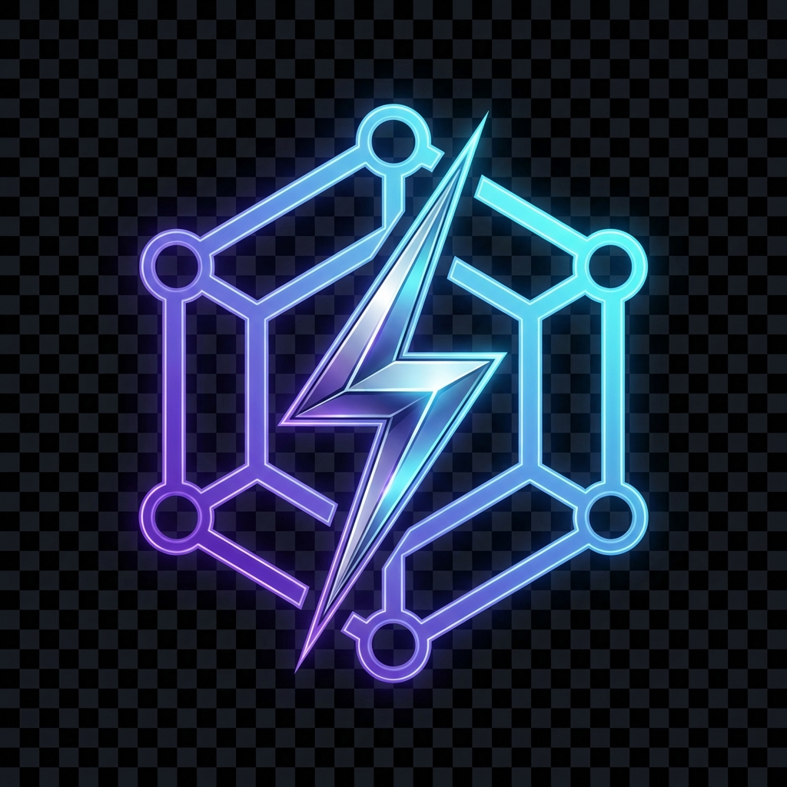

# BARQ HUB - AI Management Console

<div align="center">
  
  <h1>BARQ HUB</h1>
  <p><strong>Enterprise-grade AI Orchestration & Management Platform</strong></p>
  
  [](LICENSE)
  [](src)
  [](frontend)
  [](docker-compose.yml)
</div>

---

## Overview

**BARQ HUB** is a comprehensive AI management console designed for enterprises to orchestrate, monitor, and secure their AI infrastructure. It provides a unified gateway to multiple LLM providers (OpenAI, Anthropic, Google, Cohere), robust API key management, and detailed usage analytics.

Built with performance and security in mind, BARQ HUB leverages a high-performance **Rust** backend and a modern **Next.js** frontend.

## Key Features

- **Multi-Provider Gateway**: Unified API access to OpenAI, Anthropic, Mistral, Groq, Together AI, and Cohere.
- **API Key Management**: Create keys with granular scopes, rate limits, and auto-rotation policies.
- **Real-time Analytics**: Monitor request volume, latency, and costs with interactive dashboards.
- **Enterprise Security**: Role-Based Access Control (RBAC), audit logging, and secure credential storage.
- **Interactive Playground**: Test prompts and models directly with auto-generated code snippets (Python, JS, Go, Rust).
- **Cost Control**: Set budget limits and track spending by provider or application.
- **Production Ready**: Efficient Docker containerization and comprehensive health checks.

## Architecture

- **Frontend**: Next.js 14 (App Router), TypeScript, Tailwind CSS 4, Shadcn/ui, Zustand, React Query.
- **Backend**: Rust (Axum), Tokio, SQLx.
- **Database**: PostgreSQL 16 (Relational data).
- **Cache**: Redis 7 (Rate limiting & caching).
- **Deployment**: Docker Compose.

## Prerequisites

- **Docker** & **Docker Compose**
- **Node.js** 20+ (for local frontend dev)
- **Rust** 1.75+ (for local backend dev)

## Getting Started

### Quick Start (Docker)

The enriched production deployment runs all services (Frontend, Backend, DB, Redis) in containers.

1. **Clone the repository**
   ```bash
   git clone https://github.com/YASSERRMD/barq-hub.git
   cd barq-hub
   ```

2. **Setup Environment**
   ```bash
   cp .env.example .env
   # Edit .env with your provider API keys if needed
   ```

3. **Start Services**
   ```bash
   docker-compose up --build -d
   ```

4. **Access the Application**
   - **Console**: [http://localhost:4001](http://localhost:4001)
   - **API**: [http://localhost:4000](http://localhost:4000)
   - **Default Admin**: `admin@barq.hub` / `admin123`

### Local Development

#### Backend (Rust)
```bash
# Start dependencies
docker-compose up postgres redis -d

# Run backend
cargo run
```

#### Frontend (Next.js)
```bash
cd frontend
npm install
npm run dev
```

## Configuration

| Variable | Description | Default |
|----------|-------------|---------|
| `PORT` | Backend server port | `4000` |
| `DATABASE_URL` | PostgreSQL connection string | `postgres://...` |
| `REDIS_URL` | Redis connection string | `redis://...` |
| `JWT_SECRET` | Secret for signing auth tokens | - |
| `OPENAI_API_KEY` | OpenAI Provider Key | - |
| `ANTHROPIC_API_KEY`| Anthropic Provider Key | - |

See `.env.example` for the full list.

## API Documentation

BARQ HUB provides a RESTful API for managing your AI infrastructure programmatically.

- **Base URL**: `http://localhost:4000/v1`
- **Authentication**: Bearer Token
- **SDKs**: Coming soon for Python and Node.js.

## Contributing

We welcome contributions! Please see our [Contributing Guide](CONTRIBUTING.md) for details.

1. Fork the repo
2. Create your feature branch (`git checkout -b feature/amazing-feature`)
3. Commit your changes (`git commit -m 'feat: add amazing feature'`)
4. Push to the branch (`git push origin feature/amazing-feature`)
5. Open a Pull Request

## License

Distributed under the MIT License. See `LICENSE` for more information.

---

<div align="center">
  <p>Built with ❤️ by the BARQ Team</p>
</div>
